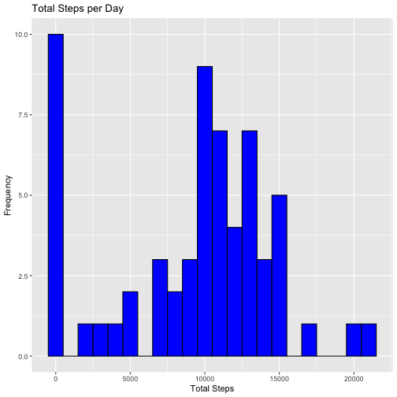
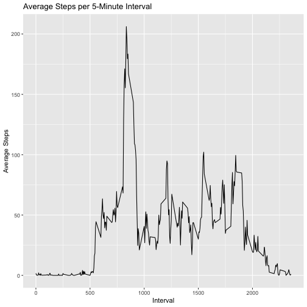
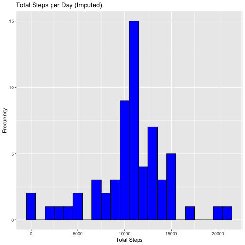
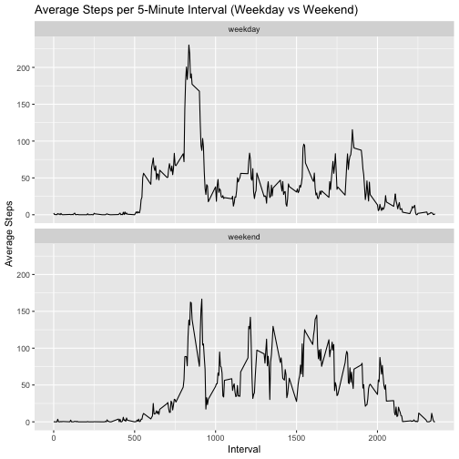

## Setup


``` r
# Load necessary libraries
library(dplyr)
```

```
## 
## Attaching package: 'dplyr'
```

```
## The following objects are masked from 'package:stats':
## 
##     filter, lag
```

```
## The following objects are masked from 'package:base':
## 
##     intersect, setdiff, setequal, union
```

``` r
library(ggplot2)

# Read the dataset (activity.csv should already be in your repo folder)
activity <- read.csv("activity.csv")

# Convert 'date' to Date format
activity$date <- as.Date(activity$date, format = "%Y-%m-%d")

# Calculate total steps per day
total_steps_per_day <- activity %>%
  group_by(date) %>%
  summarise(total_steps = sum(steps, na.rm = TRUE))

# Plot histogram of total steps per day
ggplot(total_steps_per_day, aes(x = total_steps)) +
  geom_histogram(binwidth = 1000, fill = "blue", color = "black") +
  labs(title = "Total Steps per Day", x = "Total Steps", y = "Frequency")
```



``` r
# Calculate mean and median of total steps per day
mean_steps <- mean(total_steps_per_day$total_steps, na.rm = TRUE)
median_steps <- median(total_steps_per_day$total_steps, na.rm = TRUE)

mean_steps
```

```
## [1] 9354.23
```

``` r
median_steps
```

```
## [1] 10395
```

``` r
# Calculate average steps per 5-minute interval
average_steps_per_interval <- activity %>%
  group_by(interval) %>%
  summarise(average_steps = mean(steps, na.rm = TRUE))

# Plot the time series of average steps per 5-minute interval
ggplot(average_steps_per_interval, aes(x = interval, y = average_steps)) +
  geom_line() +
  labs(title = "Average Steps per 5-Minute Interval", x = "Interval", y = "Average Steps")
```



``` r
# Find the interval with the maximum average number of steps
max_interval <- average_steps_per_interval[which.max(average_steps_per_interval$average_steps), ]
max_interval
```

```
## # A tibble: 1 × 2
##   interval average_steps
##      <int>         <dbl>
## 1      835          206.
```

``` r
# Calculate the total number of missing values in the dataset
total_na <- sum(is.na(activity$steps))
total_na
```

```
## [1] 2304
```

``` r
# Impute missing values using the mean of the specific 5-minute interval
activity_imputed <- activity %>%
  group_by(interval) %>%
  mutate(steps = ifelse(is.na(steps), mean(steps, na.rm = TRUE), steps))

# Calculate total steps per day after imputing missing values
total_steps_per_day_imputed <- activity_imputed %>%
  group_by(date) %>%
  summarise(total_steps = sum(steps))

# Plot histogram of total steps per day after imputing missing values
ggplot(total_steps_per_day_imputed, aes(x = total_steps)) +
  geom_histogram(binwidth = 1000, fill = "blue", color = "black") +
  labs(title = "Total Steps per Day (Imputed)", x = "Total Steps", y = "Frequency")
```



``` r
# Calculate mean and median of total steps per day after imputing missing values
mean_steps_imputed <- mean(total_steps_per_day_imputed$total_steps, na.rm = TRUE)
median_steps_imputed <- median(total_steps_per_day_imputed$total_steps, na.rm = TRUE)

mean_steps_imputed
```

```
## [1] 10766.19
```

``` r
median_steps_imputed
```

```
## [1] 10766.19
```

``` r
# Create a new factor variable for weekday vs weekend
activity_imputed$weekday <- weekdays(activity_imputed$date)
activity_imputed$day_type <- ifelse(activity_imputed$weekday %in% c("Saturday", "Sunday"), "weekend", "weekday")

# Calculate the average number of steps per 5-minute interval for weekdays and weekends
average_steps_weekday_weekend <- activity_imputed %>%
  group_by(day_type, interval) %>%
  summarise(average_steps = mean(steps))
```

```
## `summarise()` has grouped output by
## 'day_type'. You can override using the
## `.groups` argument.
```

``` r
# Panel plot comparing weekday and weekend activity
ggplot(average_steps_weekday_weekend, aes(x = interval, y = average_steps)) +
  geom_line() +
  facet_wrap(~day_type, ncol = 1) +
  labs(title = "Average Steps per 5-Minute Interval (Weekday vs Weekend)", x = "Interval", y = "Average Steps")
```


